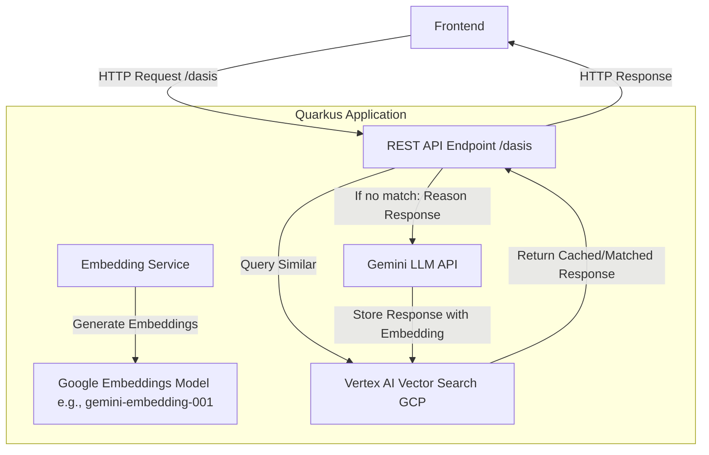
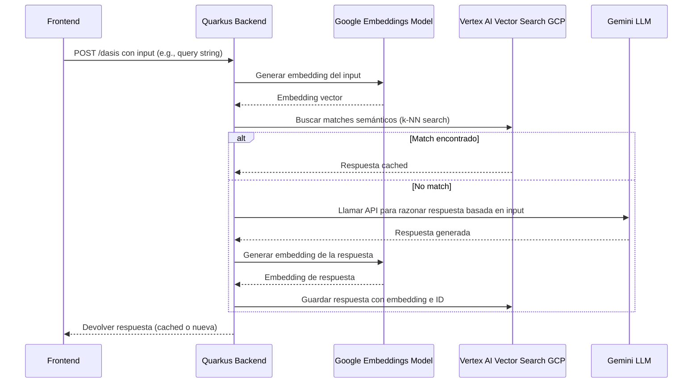

# hello-world

```mermaid
graph TD
    A[Frontend] -->|HTTP Request /dasis| B[Quarkus Backend]
    subgraph "Quarkus Application"
        B[REST API Endpoint /dasis]
        C[Embedding Service] -->|Generate Embeddings| D[Google Embeddings Model e.g., gemini-embedding-001]
        B -->|Query Similar| E[Vertex AI Vector Search GCP]
        B -->|If no match: Reason Response| F[Gemini LLM API]
        F -->|Store Response with Embedding| E
        E -->|Return Cached/Matched Response| B
    end
    B -->|HTTP Response| A
```

```mermaid
sequenceDiagram
    participant Front as Frontend
    participant Quarkus as Quarkus Backend
    participant Embed as Google Embeddings Model
    participant Vector as Vertex AI Vector Search GCP
    participant Gemini as Gemini LLM

    Front->>Quarkus: POST /dasis con input (e.g., query string)
    Quarkus->>Embed: Generar embedding del input
    Embed-->>Quarkus: Embedding vector
    Quarkus->>Vector: Buscar matches semánticos (k-NN search)
    alt Match encontrado
        Vector-->>Quarkus: Respuesta cached
    else No match
        Quarkus->>Gemini: Llamar API para razonar respuesta basada en input
        Gemini-->>Quarkus: Respuesta generada
        Quarkus->>Embed: Generar embedding de la respuesta
        Embed-->>Quarkus: Embedding de respuesta
        Quarkus->>Vector: Guardar respuesta con embedding e ID
    end
    Quarkus-->>Front: Devolver respuesta (cached o nueva)

```
